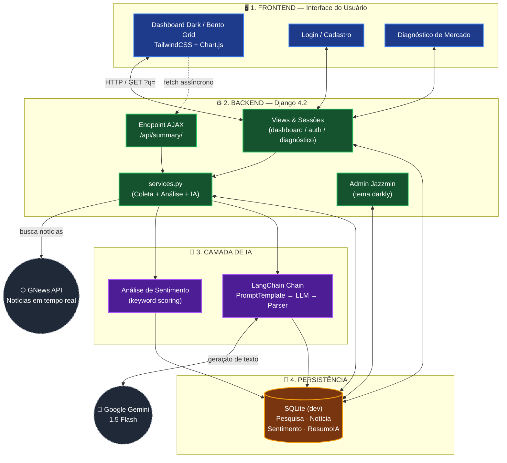
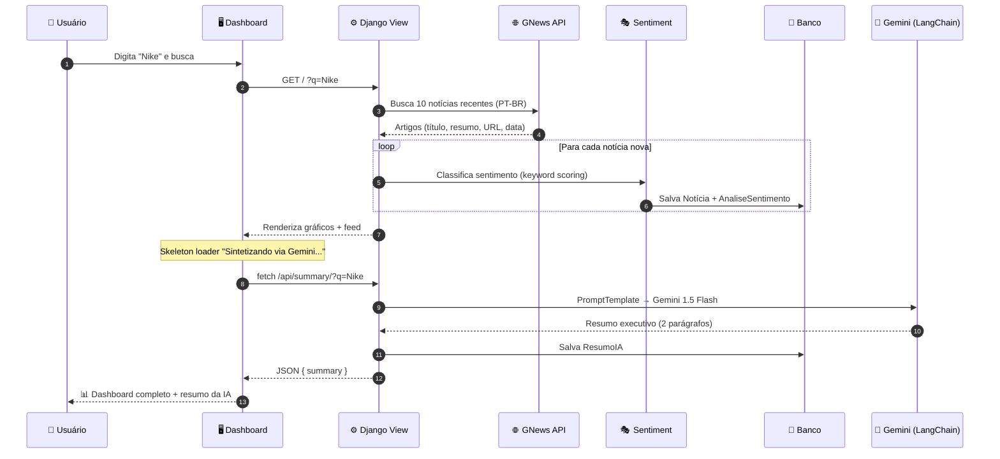
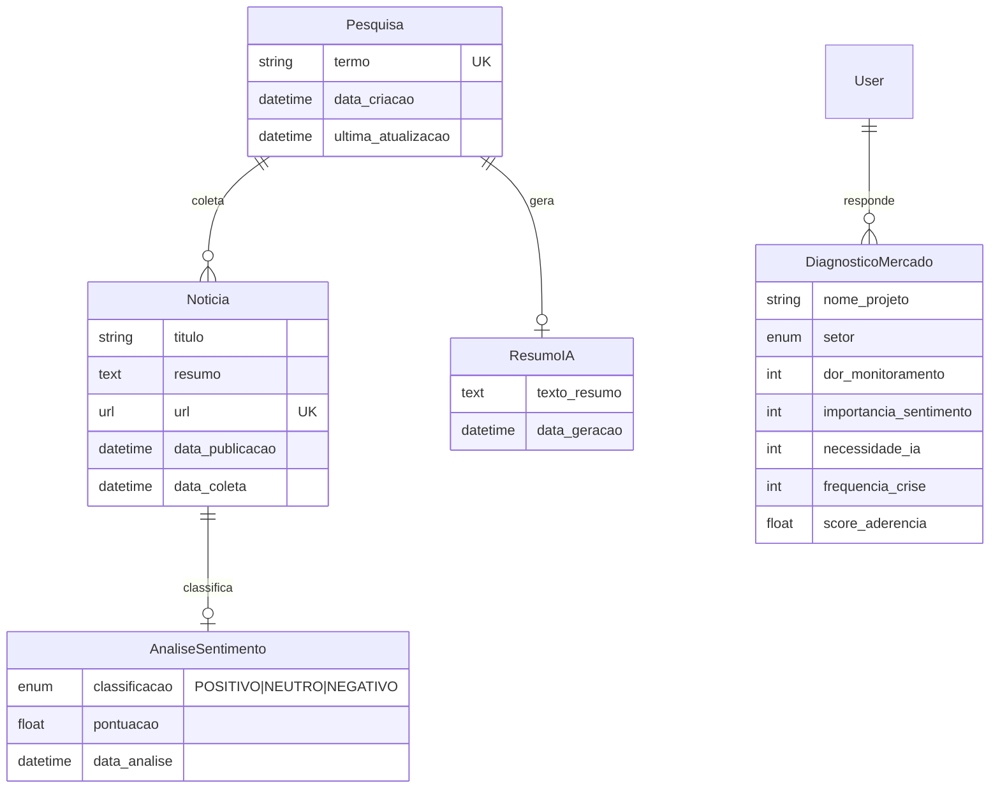
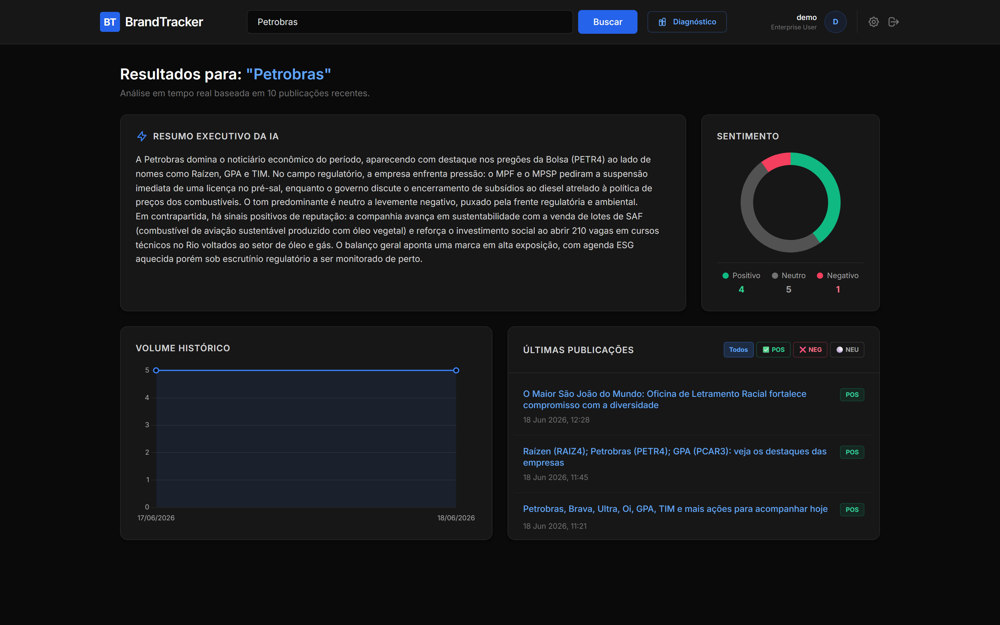
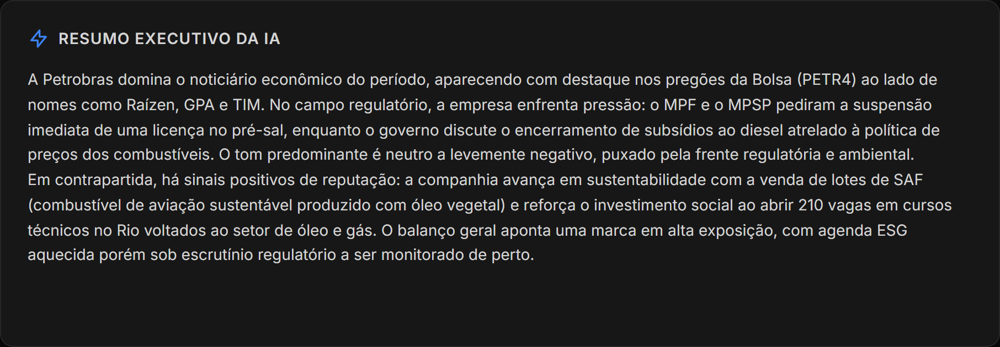
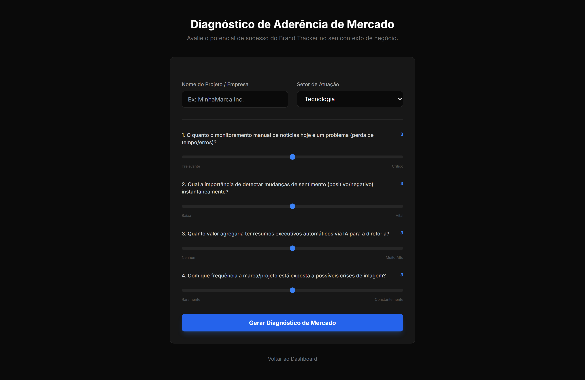
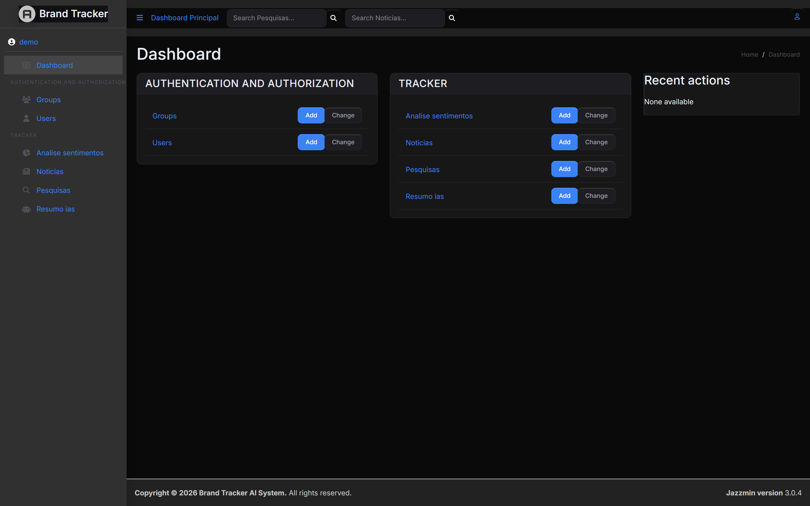

<div align="center">

# 📡 Brand Tracker AI

### Plataforma de Inteligência de Reputação de Marcas em Tempo Real

*Monitore como sua marca aparece na mídia, classifique o sentimento das notícias automaticamente e gere resumos executivos com Inteligência Artificial — tudo em um dashboard único.*

<br>


<br>

[✨ Funcionalidades](#-funcionalidades) •
[🏗️ Arquitetura](#️-arquitetura) •
[🚀 Como Rodar](#-como-rodar-em-5-minutos) •
[🧠 Como a IA Funciona](#-como-a-ia-funciona) •
[📸 Screenshots](#-screenshots)

</div>

---

## 🎯 O Problema

> Monitorar a reputação de uma marca **manualmente** é lento, caro e sujeito a viés. Quando uma crise de imagem aparece, normalmente já é tarde demais.

O **Brand Tracker AI** resolve isso: digite o nome de uma marca, concorrente ou tema e, em segundos, a plataforma:

1. 🌐 **Coleta** as notícias mais recentes em fontes reais (via GNews API);
2. 🎭 **Classifica** o sentimento de cada notícia (Positivo / Neutro / Negativo);
3. 📊 **Visualiza** o volume histórico e a distribuição de sentimento em gráficos interativos;
4. 🤖 **Sintetiza** tudo em um *resumo executivo* escrito por IA (Google Gemini) — como se um analista de RP tivesse lido tudo por você.

---

## ✨ Funcionalidades

| | Recurso | Descrição |
|:--:|---|---|
| 🔍 | **Busca de Marcas** | Pesquise qualquer termo, marca ou concorrente e dispare uma varredura em tempo real. |
| 📰 | **Coleta Automática de Notícias** | Integração com a **GNews API** (notícias em PT-BR) com deduplicação por URL. |
| 🎭 | **Análise de Sentimento** | Classificação automática (Positivo / Neutro / Negativo) com pontuação por notícia. |
| 🤖 | **Resumo Executivo por IA** | **Google Gemini 1.5 Flash** via **LangChain** gera um briefing de RP em 2 parágrafos. |
| 📊 | **Dashboard Interativo** | Gráficos **Chart.js**: rosca de sentimento + linha de volume histórico, com filtros clicáveis. |
| 🏥 | **Diagnóstico de Mercado** | Questionário de aderência (escala 1–5) que calcula um *score* de fit do produto (0–100%). |
| 🔐 | **Autenticação Completa** | Login, cadastro e logout com proteção de rotas. |
| 🎨 | **Painel Admin Premium** | Django Admin com tema dark **Jazzmin** (`darkly`) e ícones customizados. |

> 💡 **Destaque de UX:** clique em uma fatia do gráfico de sentimento ou em um ponto da linha de volume — o feed de notícias filtra **na hora**, sem recarregar a página.

---

## 🏗️ Arquitetura

O sistema segue uma arquitetura em camadas, com o backend Django orquestrando a coleta de dados, a análise de sentimento e a geração de texto por IA.



<div align="center"><sub>🔵 Frontend &nbsp;·&nbsp; 🟢 Backend &nbsp;·&nbsp; 🟣 IA &nbsp;·&nbsp; 🟠 Persistência &nbsp;·&nbsp; ⚪ Serviços Externos</sub></div>

---

## 🔄 Fluxo de uma Pesquisa

Da digitação do usuário até o resumo gerado pela IA:



---

## 🗃️ Modelo de Dados



---

## 🧠 Como a IA Funciona

O Brand Tracker combina **duas técnicas de IA** complementares:

### 1. 🎭 Análise de Sentimento (rápida, local)
Cada notícia recebe uma pontuação baseada em léxico — listas de **palavras positivas** (`sucesso`, `recorde`, `lucro`...) e **negativas** (`crise`, `queda`, `escândalo`...). O saldo define a classificação:

```
score > 0  → 🟢 POSITIVO
score = 0  → ⚪ NEUTRO
score < 0  → 🔴 NEGATIVO
```

> ⚡ Roda instantaneamente, sem custo de API, ideal para classificar dezenas de notícias.

### 2. 🤖 Resumo Executivo (LangChain + Google Gemini)
As notícias coletadas viram o **contexto** de um prompt cuidadosamente construído. Uma *chain* LangChain (`PromptTemplate → ChatGoogleGenerativeAI → StrOutputParser`) pede ao **Gemini 1.5 Flash** um briefing no tom de um analista de Relações Públicas. O prompt se **adapta** à quantidade de dados disponível (alerta o usuário quando há poucas notícias).

---

## 🛠️ Stack Tecnológica

| Camada | Tecnologias |
|---|---|
| **Frontend** | TailwindCSS (CDN) · Chart.js · Inter Font · Dark Mode · Bento Grid |
| **Backend** | Python 3.13 · Django 4.2 · Sessões & Auth nativas |
| **IA** | LangChain · `langchain-google-genai` · Google Gemini 1.5 Flash |
| **Dados** | GNews API (coleta) · SQLite (dev) · PostgreSQL-ready (`psycopg2`) |
| **Admin** | Django Jazzmin (tema `darkly`) |
| **Infra (opcional)** | Celery · Redis · Channels · Daphne |

---

## 🚀 Como Rodar em 5 Minutos

### Pré-requisitos
- **Python 3.10+** no PATH
- Chaves de API:
  - 🔑 `GNEWS_API_KEY` — grátis em [gnews.io](https://gnews.io)
  - 🔑 `GEMINI_API_KEY` — grátis em [Google AI Studio](https://aistudio.google.com)

### 1️⃣ Clone o repositório
```bash
git clone <url-do-repositorio>
cd projetoIII
```

### 2️⃣ Crie e ative um ambiente virtual *(recomendado)*
```powershell
python -m venv venv
.\venv\Scripts\Activate.ps1
```
<details>
<summary>💡 Comando de ativação por terminal</summary>

| Terminal | Comando |
|---|---|
| PowerShell | `.\venv\Scripts\Activate.ps1` |
| CMD | `venv\Scripts\activate.bat` |
| Git Bash | `source venv/Scripts/activate` |

> Se o PowerShell bloquear scripts: `Set-ExecutionPolicy -Scope CurrentUser -ExecutionPolicy RemoteSigned`

</details>

### 3️⃣ Instale as dependências
```bash
pip install -r requirements.txt
```

### 4️⃣ Configure o arquivo `.env` na raiz
```env
GNEWS_API_KEY=sua-chave-gnews-aqui
GEMINI_API_KEY=sua-chave-gemini-aqui
SECRET_KEY=uma-chave-secreta-forte-aqui
DEBUG=True
ALLOWED_HOSTS=localhost,127.0.0.1
```
> ⚠️ Nunca versione o `.env` com chaves reais — ele já está no `.gitignore`.

### 5️⃣ Banco de dados e superusuário
```bash
python manage.py migrate
python manage.py createsuperuser
```

### 6️⃣ Suba o servidor 🎉
```bash
python manage.py runserver
```

| URL | Página |
|---|---|
| 🏠 http://127.0.0.1:8000/ | Dashboard principal |
| 🏥 http://127.0.0.1:8000/diagnostico/ | Diagnóstico de Mercado |
| 🔐 http://127.0.0.1:8000/admin/ | Painel administrativo (Jazzmin) |

---

## 📸 Screenshots

> Capturas reais da aplicação rodando, com dados coletados ao vivo da GNews API.

<div align="center">

### 🏠 Dashboard — Visão Geral


### 🤖 Resumo Executivo da IA + Gráficos de Sentimento


### 🏥 Diagnóstico de Mercado


### 🎨 Painel Admin (Jazzmin Dark)


</div>

---

## 🗂️ Estrutura do Projeto

```
projetoIII/
├── backend/                  # Configuração do projeto Django
│   ├── settings.py           # DB, apps, Jazzmin, auth
│   ├── urls.py               # Roteamento raiz
│   ├── asgi.py / wsgi.py     # Servidores (Daphne / WSGI)
├── tracker/                  # App principal
│   ├── models.py             # Pesquisa, Noticia, AnaliseSentimento, ResumoIA, DiagnosticoMercado
│   ├── views.py              # Dashboard, auth, diagnóstico, endpoint de IA
│   ├── services.py           # 🌟 Coleta (GNews) + Sentimento + Resumo (Gemini)
│   ├── urls.py               # Rotas do app
│   ├── admin.py              # Configuração do admin
│   ├── templates/            # dashboard, login, register, diagnóstico, admin
│   └── static/               # CSS customizado do admin
├── manage.py                 # CLI do Django
├── requirements.txt          # Dependências
└── .env                      # Variáveis de ambiente (não versionar!)
```

---

## 🔧 Comandos Úteis

```bash
python manage.py check            # Valida a configuração do projeto
python manage.py makemigrations   # Gera migrations após alterar models
python manage.py migrate          # Aplica migrations
python manage.py collectstatic    # Coleta estáticos (produção)
python manage.py shell            # Shell interativo do Django
```

---

## 🗺️ Roadmap

- [ ] Substituir o sentimento por léxico por um modelo de NLP (ou o próprio Gemini)
- [ ] Migrar para **PostgreSQL + pgvector** e implementar **RAG** sobre o histórico de notícias
- [ ] Coleta agendada de notícias com **Celery + Redis**
- [ ] Streaming do resumo da IA em tempo real via **Django Channels (WebSockets)**
- [ ] Exportação de relatórios em PDF
- [ ] Alertas automáticos de crise de imagem

---

## 📄 Licença

Projeto acadêmico desenvolvido para a **Pós FATEC — Projeto III**.

<div align="center">
<br>
<sub>Feito com ☕ e 🤖 por <b>Filipe Ferreira</b></sub>
</div>
