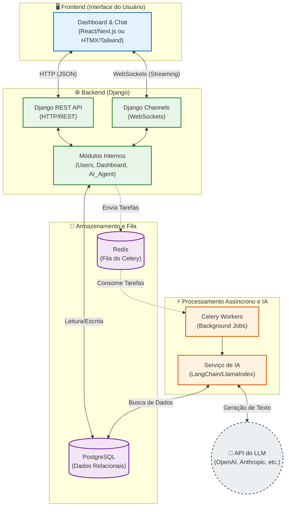

# Diagrama de Arquitetura do Projeto

Abaixo está o diagrama visual da arquitetura proposta para o sistema Django com Dashboard Interativo e Agente de IA.

## Como ler o diagrama:
1. **Frontend**: O usuário interage com o dashboard e o chat, enviando requisições REST tradicionais para atualizações e WebSockets para streaming em tempo real do agente de IA.
2. **Backend**: O Django atua como o cérebro central, recebendo as solicitações. `Django Channels` gerencia a comunicação em tempo real e o `Django REST API` gerencia os endpoints CRUD.
3. **Async & IA**: Quando uma solicitação exige IA, ela é enviada para a fila (`Redis`) onde os `Celery Workers` pegam o trabalho pesado sem travar o sistema. O agente processa a lógica utilizando ferramentas como `LangChain`.
4. **Armazenamento**: O agente consulta o banco relacional (`PostgreSQL`) para obter os dados estruturados do sistema e montar o contexto.
5. **LLM**: Por fim, a requisição é formatada e enviada de forma externa para o modelo de inteligência artificial (OpenAI, Anthropic, etc.) e a resposta é devolvida ao usuário.
