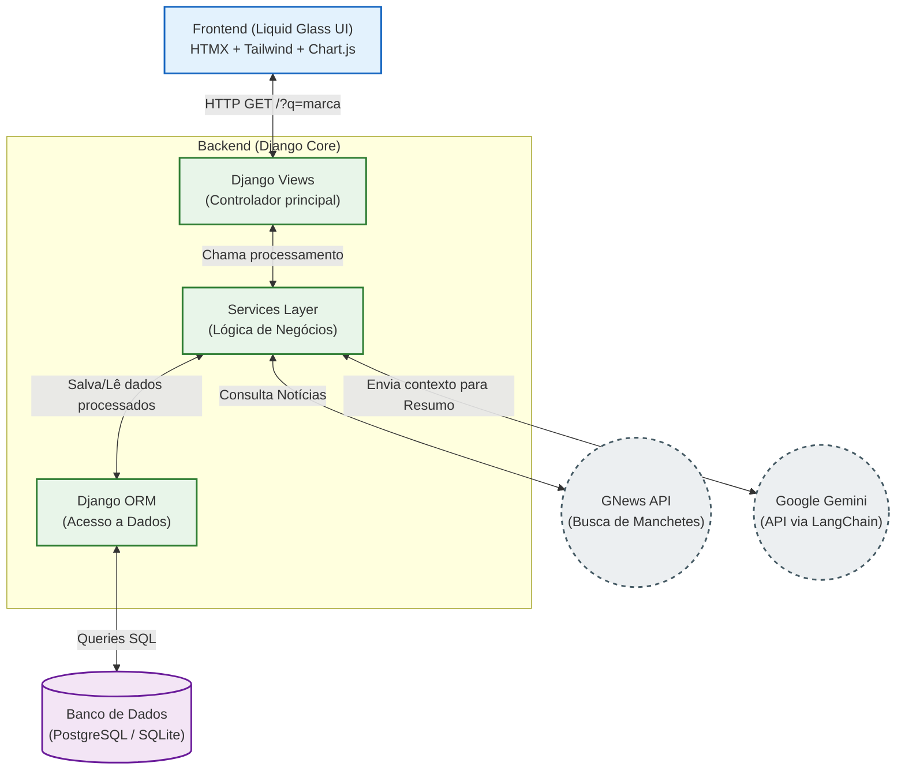
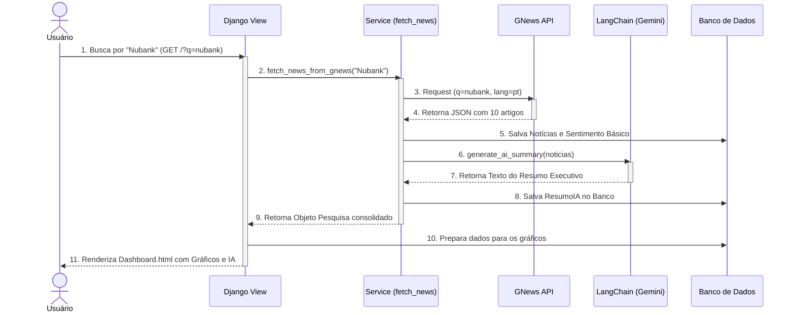
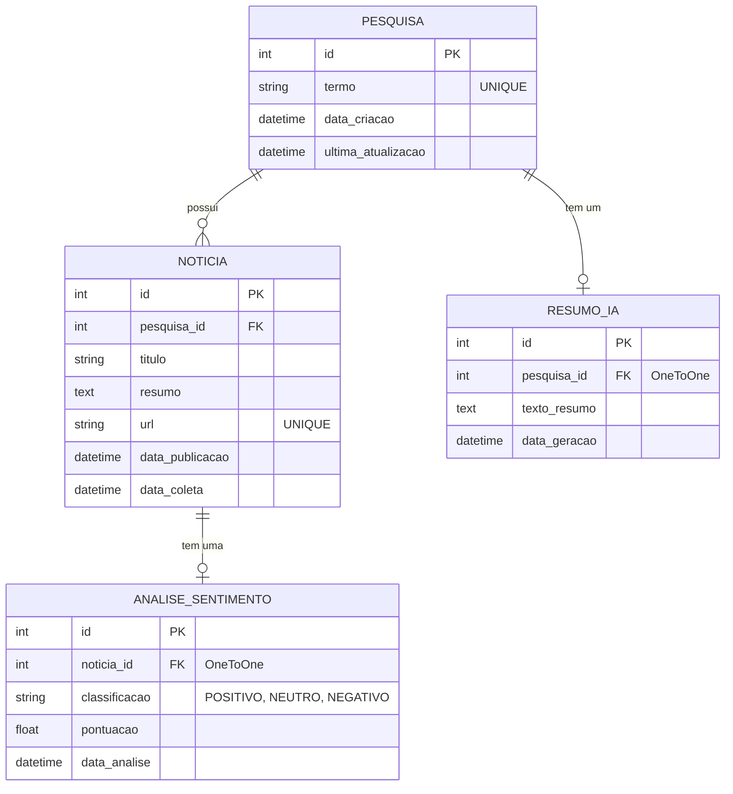

# 📚 Documentação Técnica e Diagramas: Brand Tracker

Visão completa da arquitetura, fluxo de dados e casos de uso do sistema Brand Tracker.

---

## 👤 1. Diagrama de Casos de Uso (Use Case)

Mapeia as interações do usuário final com as funcionalidades do sistema e como a Inteligência Artificial e a API Externa atuam como "Atores Secundários" no processo.

```mermaid
usecaseDiagram
    actor Usuário as "Usuário (Analista)"
    actor GNews as "API de Notícias\n<<Sistema Externo>>"
    actor Gemini as "Google Gemini\n<<LLM API>>"

    package "Brand Tracker App" {
        usecase UC1 as "Pesquisar Marca/Termo"
        usecase UC2 as "Visualizar Dashboard"
        usecase UC3 as "Consultar Gráfico de Sentimento"
        usecase UC4 as "Consultar Volume Temporal"
        usecase UC5 as "Ler Resumo da IA"
        usecase UC6 as "Ler Manchetes Originais"
        
        usecase UC7 as "Coletar Notícias"
        usecase UC8 as "Analisar Sentimento (NLP)"
        usecase UC9 as "Gerar Resumo Executivo"
    }

    Usuário --> UC1
    Usuário --> UC2
    
    UC2 ..> UC3 : <<include>>
    UC2 ..> UC4 : <<include>>
    UC2 ..> UC5 : <<include>>
    UC2 ..> UC6 : <<include>>
    
    UC1 ..> UC7 : <<include>>
    UC7 --> GNews
    
    UC7 ..> UC8 : <<include>>
    UC7 ..> UC9 : <<include>>
    
    UC9 --> Gemini
```

---

## 🏗️ 2. Arquitetura Técnica do Sistema

A visão estrutural mostrando as tecnologias envolvidas, desde a interface de usuário (Frontend) até o processamento síncrono/assíncrono no Backend e armazenamento.



---

## ⏱️ 3. Diagrama de Sequência (Fluxo de Busca)

Demonstra o passo a passo cronológico de tudo que acontece nos bastidores quando o usuário clica no botão "Analisar".



---

## 💾 4. Diagrama Entidade-Relacionamento (Banco de Dados)

Mostra a estrutura do banco de dados relacional (ORM do Django) que construímos para o projeto.


